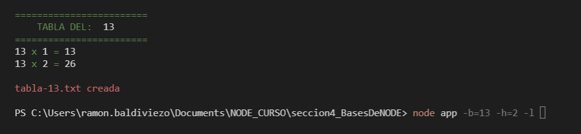

# PRIMER APP DE PRACTICA DEL CURSO DE NODE 

**Comandos por consola de la App**

```
    Opciones:
        --help     Muestra ayuda                                        [booleano]
        --version  Muestra número de versión                            [booleano]
    -b, --base     Es la base de la tabla de multiplicar      [número] [requerido]
    -h, --hasta    Es el limite de la cantidad de multiplicaciones a realizar
                                                            [número] [defecto: 10]
    -l, --listar   Muestra la tabla de multiplicar     [booleano] [defecto: false] 
```


